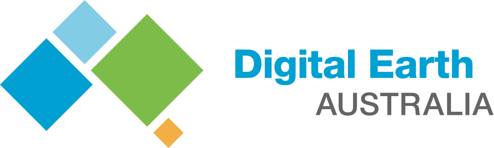

.. Digital Earth Australia documentation master file, created by
   sphinx-quickstart on Wed Jun  7 17:22:24 2017.
   You can adapt this file completely to your liking, but it should at least
   contain the root `toctree` directive.

|
|

Digital Earth Australia User Guide
##################################

Digital Earth Australia is an analysis platform for satellite imagery and other Earth observations.

For more information on the project, see http://www.ga.gov.au/dea

Digital Earth Australia is currently in a private beta for Australian government and academic users eligible for
accounts on National Computational Infrastructure (NCI).

Publicly available data access and web services are currently in development.

.. toctree::
   :maxdepth: 1
   :caption: Overview

   about/intro.rst
   about/glossary.rst
   about/changelog.rst

.. toctree::
   :maxdepth: 1
   :caption: Connect

   connect/account.rst
   connect/install.rst
   connect/nci_basics.rst
   connect/jupyter.rst

.. toctree::
   :maxdepth: 1
   :caption: User Guide

   notebooks/Getting_started/README.rst
   notebooks/DEA_datasets/README.rst
   notebooks/Integrating_external_data/README.rst
   notebooks/Index_calculation/README.rst
   notebooks/Temporal_analysis/README.rst
   notebooks/Composite_generation/README.rst
   notebooks/Image_classification/README.rst
   notebooks/Outputting_data/README.rst
   notebooks/Workflows/README.rst
   notebooks/Scripts/README.rst

.. toctree::
   :maxdepth: 1
   :caption: Data Guide

   data/data.rst

.. toctree::
   :maxdepth: 1
   :caption: Developer Guide

   internal/new_product.rst
   internal/git_best_practice.rst
   internal/release.rst
   internal/modules.rst
   internal/other_modules.rst
   internal/orchestration.rst
   internal/collection_management.rst
   internal/goalkeeper_instructions.rst
   internal/requirements_met.ipynb

.. toctree::
   :hidden:

   genindex
