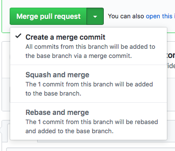

.. highlight:: console
.. internal_git_best_practice

================================================
Git Best Practice
================================================

We use git for version control management. Repositories are usually hosted on
GitHub. In this document we assume that you are already familiar with the common
terminology around version control in git. If terms like ``clone``,
``checkout``, ``commit``, ``pull``, ``branch`` don't have a clear meaning for you
please consider reading up on git online first.

- `<https://www.atlassian.com/git>`_ good introduction, but dives deep too
- `<https://help.github.com>`_ covers a lot of detail and github specifics

Main Principles
------------------

Below are the main guiding principles, we will expand on that through out the document

- Treat commit history as a form of documentation
- Group related changes together
- Avoid combining unrelated changes into one commit
- Communicate intent and context of the change not just what changed
- Maintain mostly linear history

In the ideal world code is written once and is perfect from the start: there are
no mistakes and all future uses are anticipated and catered for at the time of
inception. In this perfect world every new commit is new code which adds new
features. In the real world people make mistakes in the code, third party APIs
change without any warning, code formatting is sometimes off, all these things
stand in the way, all need to be fixed in the process of developing the new
feature. While all these changes are necessary, they are still incidental to the
core task of new feature development. We should try to put each incidental
change into a separate commit. Separating "preparatory work" from "actual new
feature" really helps with code review.

Commit messages are an important communication channel, use them to communicate
information that can not be easily extracted from the code: why was the change
necessary, what that means for code that might depend on the code that got
changed. Try to provide context for the change without being overly verbose.

Git is a very flexible tool and allows for a broad range of workflows, changes
can be happening in a number of parallel branches, those branches can then be
*merged* in any order creating a rather non-linear history which can be hard to
follow. We adopt a more constrained approach, commonly referred as "Feature
Branch Workflow". In short this means that there is one main branch ``master``
or ``develop``, no major work is done in the main branch, instead new features
are developed in separate feature branches, those then get merged into the main
branch when ready.

Commit Message Format
-----------------------------

Good commit messages make collaboration easier. Commit message should consist of
short summary line, 50 characters of less, followed by a blank line, followed by
expanded description. It is fine to omit expanded description and the blank line
before it if the change is small. Start your summary line with a capital letter,
don't put full stop [.] at the end of the summary line.

Many tools, GitHub including, expect this format and sticking to it makes
inspecting history more accessible.

.. note ::

    Could be helpful to prescribe how summary line is to be phrased. Which do we
    prefer?

    - Fixed spelling mistake in the help message
    - Fix spelling mistake in the help message

For a more expanded exploration of the topic see `<https://chris.beams.io/posts/git-commit/>`_

Clean Linear History
---------------------

Pull with Rebase
^^^^^^^^^^^^^^^^^

When grabbing changes from remote use ``--rebase`` switch, this keeps history
linear by replaying your changes on top of remote changes.

For example ``git pull --rebase origin master``. Alternatively make pull with
rebase a global default ``git config --global pull.rebase true``. Your editor
probably has this option, certainly PyCharm supports pulling with rebase.

Cleanup Before Sharing
^^^^^^^^^^^^^^^^^^^^^^

Just like code can be edited, so can be git history. You don't need to type out
perfect code on the first try, you don't need to delay committing your code
until it's "just right", "work in progress" commits are perfectly fine so long
as you clean it up before sharing your changes.

The easiest and most common method is to *amend* the very last commit ``git
commit --amend``. Maybe you want to correct a typo in the commit message, or you
forgot to add a new file, you can easily amend last commit. Your editor most
likely supports that out of the box.

A more comprehensive method is *Interactive Rebase*, it allows to re-order
commits, squash independent commits into one, update commit messages for older
commits and more. While you can use it with just plain command line ``git
rebase -i HEAD~3``, it's probably best to use some kind of GUI client for
complex tasks like that. Maybe your editor/IDE already supports that, if not try
some of the tools listed below

- `<https://www.gitkraken.com>`_
- `<https://www.sourcetreeapp.com>`_
- Docs for plain git `<https://help.github.com/articles/changing-a-commit-message/>`_

Initial Setup
----------------

When setting up new dev machine make sure that your git identity is properly configured.

.. code-block:: bash

    git config --global user.name "YourFirstName YourLastName"
    git config --global user.email "your_email@example.com"
    # configure other useful options
    git config --global pull.rebase true
    # review
    git config --list

Bug Fix Workflow
----------------------

1. Create issue on GitHub, if not created already
2. Create new branch with a reasonable name, ``fix-issue-273`` is fine
3. Develop a fix and hopefully unit tests
4. Commit your changes to local branch
5. Pull changes from main branch into your branch with rebase
6. Push your branch to GitHub
7. Create pull request

New Feature Workflow
-----------------------

TODO

Pull Requests
----------------

When accepting pull requests GitHub gives you three different options. The
default behavior is to create a merge commit *"Merge pull request"*. Use this
option for larger requests.

For smaller changes, a bug fix or a small feature, couple of small commits in
size, use the *"Rebase and merge"* option. This will make it look like the
feature was developed directly in the main branch.

Links
----------------------

- `<https://chris.beams.io/posts/git-commit/>`_
- `<https://www.jetbrains.com/help/pycharm/2017.2/using-git-integration.html>`_
- `<https://help.github.com/articles/changing-a-commit-message/>`_
- `<https://www.gitkraken.com>`_
- `<https://www.sourcetreeapp.com>`_
- `<https://www.atlassian.com/git>`_ 
- `<https://help.github.com>`_ 
